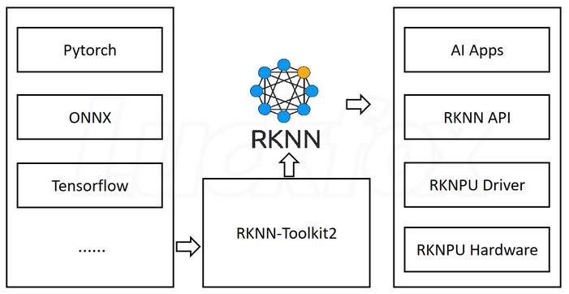

# RKNPU

* support operators list: https://github.com/rockchip-linux/rknn-toolkit2/blob/master/doc/05_RKNN_Compiler_Support_Operator_List_v1.6.0.pdf


* The NPU integrated into Rockchip processors is called RKNPU.
* RV1103/RV1106 chips, which feature Rockchip's 4th generation self-developed NPU.
* supports mixed quantization of int4, int8, and int16
* the int8 computation power is 0.5 TOPs, and the int4 computation power can reach 1.0 TOPs
* RKNPU4.0 is subdivided into RKNPU2, so using RKNPU2 SDK and toolkits is necessary.

## RKNN-Toolkit2

* provides C or Python interfaces on the PC platform to simplify the deployment and execution of models.
* support:

```
        model conversion, 
        quantization, 
        inference, 
        performance and memory evaluation, 
        quantization accuracy analysis, 
        model encryption

```


first run the RKNN-Toolkit2 tool on their computer to convert the trained model into the RKNN format model, and then deploy it on the development board using the RKNN C API or Python AP

