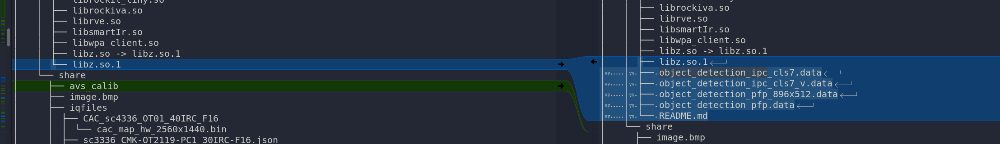

./dump_prebuild_fw_20240605/unpack/oem/usr/lib/object_detection_ipc_cls7.data

│       │   ├── object_detection_ipc_cls7.data
│       │   ├── object_detection_ipc_cls7_v.data
│       │   ├── object_detection_pfp_896x512.data
│       │   ├── object_detection_pfp.data
│       │   └── README.md
│       └── share


## 

* ./dump_prebuild_fw_20240605/unpack/oem/usr/lib/README.md

```
目标检测模型（人、人脸、人头、机动车、非机动车、宠物(猫狗)）：
object_detection_ipc_cls7.data： 输入为896x512x3
object_detection_ipc_cls7_v.data： 输入为512x896x3

目标检测（人、人脸、宠物(猫狗)）
object_detection_pfp.data: 输入为512x288x3 
object_detection_pfp_896x512.data：输入为896x512x3

注1：如果需要使用896x512x3模型，只需把文件名object_detection_pfp_896x512.data改为object_detection_pfp.data并替换即可生效

注2：如果需要选用人、人脸、宠物的检测模型，初始化时配置参数需要加上宠物类别
commonParams->detObjectType |= ROCKIVA_OBJECT_TYPE_PET;
commonParams->detObjectType |= ROCKIVA_OBJECT_TYPE_FACE;
commonParams->detObjectType |= ROCKIVA_OBJECT_TYPE_PERSON;

人脸质量评估：
face_quality_v2.data

人脸口罩识别：
face_mask_classify.data
```

translate to english

```
# Object Detection and Face Analysis Models

## Object Detection Models (People, Faces, Heads, Motor Vehicles, Non-Motor Vehicles, Pets [Cats & Dogs])

- **object_detection_ipc_cls7.data**  
  Input size: **896 × 512 × 3**

- **object_detection_ipc_cls7_v.data**  
  Input size: **512 × 896 × 3**

---

## Object Detection (People, Faces, Pets [Cats & Dogs])

- **object_detection_pfp.data**  
  Input size: **512 × 288 × 3**

- **object_detection_pfp_896x512.data**  
  Input size: **896 × 512 × 3**

### Notes
1. If you need to use the **896 × 512 × 3** model, simply rename  
   `object_detection_pfp_896x512.data` → `object_detection_pfp.data` and replace it.  
   This will activate it.

2. If you need to select the detection model for **people, faces, and pets**, during initialization the configuration parameters must include the pet category:

commonParams->detObjectType |= ROCKIVA_OBJECT_TYPE_PET;
commonParams->detObjectType |= ROCKIVA_OBJECT_TYPE_FACE;
commonParams->detObjectType |= ROCKIVA_OBJECT_TYPE_PERSON;

```

## in the buildroot git:

```
./media/iva/iva/models/rockiva_data_rv1106
├── object_detection_pfp_896x512.data
└── object_detection_pfp.data
```