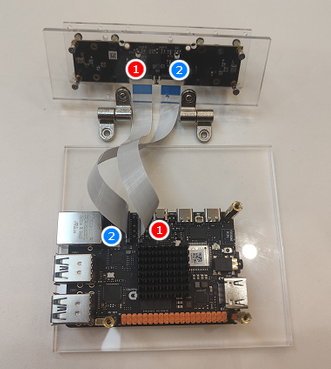

# demo1 : depth

* https://d-robotics.github.io/rdk_doc/en/Robot_development/boxs/function/hobot_stereonet#function-introduction
* https://github.com/D-Robotics/hobot_stereonet/




```
root@ubuntu:~# i2cdetect -r -y 4
     0  1  2  3  4  5  6  7  8  9  a  b  c  d  e  f
00:                         -- -- -- -- -- -- -- -- 
10: -- -- -- -- -- -- -- -- -- -- -- -- -- -- -- -- 
20: -- -- -- -- -- -- -- -- -- -- -- -- -- -- -- -- 
30: 30 -- -- -- -- -- -- -- -- -- -- -- -- -- -- -- 
40: -- -- -- -- -- -- -- -- -- -- -- -- -- -- -- -- 
50: 50 -- -- -- -- -- -- -- 58 -- -- -- -- -- -- -- 
60: -- -- -- -- -- -- -- -- -- -- -- -- -- -- -- -- 
70: -- -- -- -- -- -- -- --                         
root@ubuntu:~# i2cdetect -r -y 6
     0  1  2  3  4  5  6  7  8  9  a  b  c  d  e  f
00:                         -- -- -- -- -- -- -- -- 
10: -- -- -- -- -- -- -- -- -- -- -- -- -- -- -- -- 
20: -- -- -- -- -- -- -- -- -- -- -- -- -- -- -- -- 
30: -- -- 32 -- -- -- -- -- -- -- -- -- -- -- -- -- 
40: -- -- -- -- -- -- -- -- -- -- -- -- -- -- -- -- 
50: 50 -- -- -- -- -- -- -- 58 -- -- -- -- -- -- -- 
60: -- -- -- -- -- -- -- -- -- -- -- -- -- -- -- -- 
70: -- -- -- -- -- -- -- --   

```


```
# Configure the tros.b humble environment
source /opt/tros/humble/setup.bash

# Start the stereo model launch file, which includes the algorithm and stereo camera node
ros2 launch hobot_stereonet stereonet_model_web_visual_v2.3.launch.py \
mipi_image_width:=640 mipi_image_height:=352 mipi_lpwm_enable:=True mipi_image_framerate:=30.0 \
need_rectify:=False height_min:=-10.0 height_max:=10.0 pc_max_depth:=5.0

```

## web gui
* check on port :8000