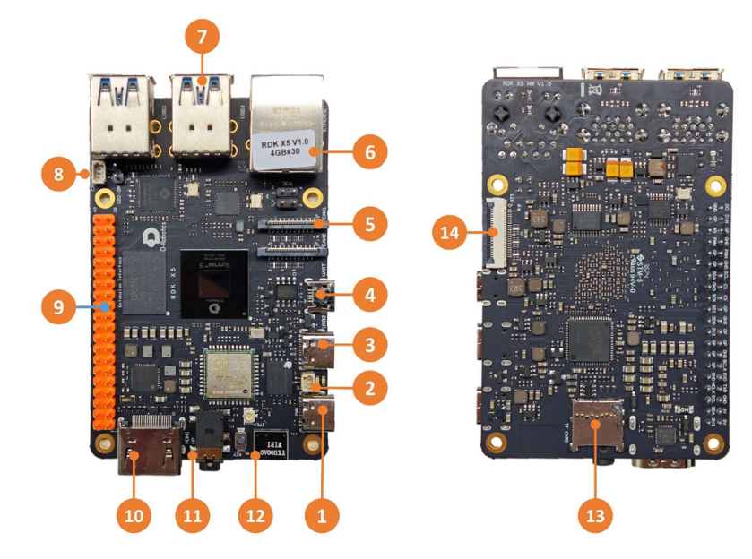
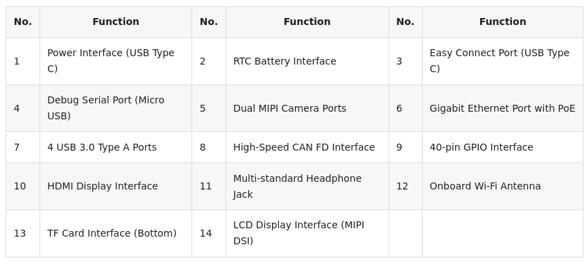

# Rock D Robotics RDK X5

* https://d-robotics.cc/
* https://d-robotics.github.io/rdk_doc/en/RDK/
* https://developer.d-robotics.cc/rdkx5


```
· CPU8x A55@1.5GHz
· RAM4GB/8GB LPDDR4
· BPU10 TOPS


power 5V5A

```





* dbg micro usb (4)
```

    Baud rate: 115200
    Data bits: 8
    Parity: None
    Stop bits: 1
    Flow control: None

```

* eth

```

eth0:       inet 192.168.127.10 
usb0:       inet 192.168.128.10 


```

## sw img

* https://archive.d-robotics.cc/downloads/en/os_images/rdk_x5/
    * have server/desktop versions

* https://d-robotics.github.io/rdk_doc/en/Quick_start/install_os/rdk_x5

```
https://archive.d-robotics.cc/downloads/en/os_images/rdk_x5/rdk_os_3.2.3-2025-6-26/rdk-x5-ubuntu22-preinstalled-desktop-3.2.3-arm64.img.xz

```


## post configs

```
sudo srpi-config

```